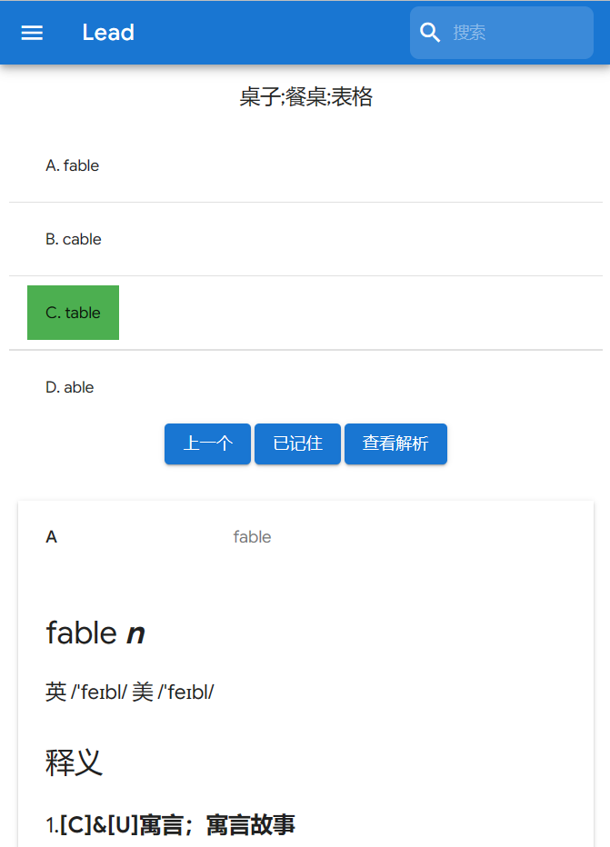
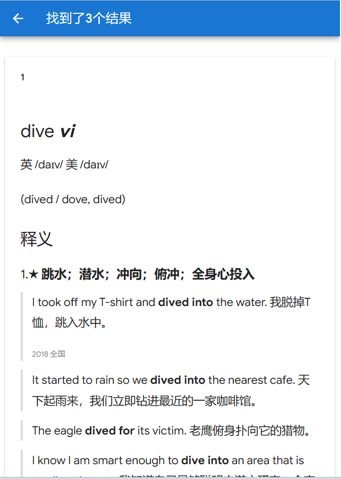

<h2 align="center">
Lead
</h2>

<p align="center">
<strong>一个简约的背单词网站</strong>
</p>

### 示例

|  |   |
|----------------------------|---------------------------------|

### API （待更新）

#### 获取题目 `/api/get_quiz`

##### Params

| 参数名        | 类型     | 必填  | 说明         |
|------------|--------|-----|------------|
| word_index | Number | 否   | 指定单词, 默认随机 |

##### Response

| 参数名    | 类型     | 说明   |
|--------|--------|------|
| status | String | 调用结果 |
| word   | String | 单词   |
| index  | Number | 单词id |
| quiz   | Object | 题目   |

##### Object quiz

| 参数名      | 类型     | 说明             |
|----------|--------|----------------|
| question | String | 题目             |
| options  | Object | 选项 A,B,C,D     |
| indexes  | Object | 选项 A,B,C,D 的id |
| answer   | String | 答案(A/B/C/D)    |

#### 回答正确 `/api/quiz_passed`

##### Params

| 参数名        | 类型     | 必填  | 说明   |
|------------|--------|-----|------|
| word_index | Number | 是   | 指定单词 |

##### Response

| 参数名    | 类型     | 说明   |
|--------|--------|------|
| status | String | 调用结果 |

#### 回答错误 `/api/quiz_failed`

##### Params

| 参数名        | 类型     | 必填  | 说明   |
|------------|--------|-----|------|
| word_index | Number | 是   | 指定单词 |

##### Response

| 参数名    | 类型     | 说明   |
|--------|--------|------|
| status | String | 调用结果 |

#### 提示 `/api/quiz_prompt`

##### Params

| 参数名        | 类型     | 必填  | 说明   |
|------------|--------|-----|------|
| word_index | Number | 是   | 指定单词 |

##### Response

| 参数名    | 类型     | 说明   |
|--------|--------|------|
| status | String | 调用结果 |
| A      | String | A 解析 |
| B      | String | B 解析 |
| C      | String | C 解析 |
| D      | String | D 解析 |

注: 解析为 html 片段，具体如下

```html
<div class=\"mdui-typo\"><h1>effective<i> adj</i></h1>英 /ɪ'fektɪv/ 美 /ɪ'fektɪv/ <h3>释义</h3>
    <ol class=\"mdui-list\">
        <li><span class=\"meaning\"><strong><span class=\"meaning\">有效的；生效的</span> ★ </strong>反 ineffective<ul
                class=\"mdui-list\"><li><div class=\"mdui-typo\"><blockquote><span id=\"example\" class=\"example\">take effective measures / steps采取有效措施</span></div></li><li><div
                class=\"mdui-typo\"><blockquote><span id=\"example\" class=\"example\">The more I understood fish, the more I became effective at finding and catching them.对鱼越了解，我越能有效地发现和捕捉到鱼。</span><footer>2015 广东</footer></div></li></ul></span>
        </li>
    </ol>
    <h3>派生词汇</h3>
    <ul class=\"mdui-list\">
        <li>effectively /ɪ'fektɪvli/ adv</li>
        <li>effectiveness /ɪˌfek'tɪvnɪs/ n [U]</li>
    </ul>
</div>
```

#### 已记住单词 `/api/pass`

##### Params

| 参数名        | 类型     | 必填  | 说明   |
|------------|--------|-----|------|
| word_index | Number | 是   | 指定单词 |

##### Response

| 参数名    | 类型     | 说明   |
|--------|--------|------|
| status | String | 调用结果 |

#### 搜索 `/api/search`

##### Params

| 参数名  | 类型     | 必填  | 说明   |
|------|--------|-----|------|
| word | String | 是   | 搜索内容 |

##### Response

| 参数名          | 类型            | 说明      |
|--------------|---------------|---------|
| status       | String        | 调用结果    |
| indexes      | Array(Number) | 单词 id   |
| explanations | Array(String) | 相应单词的解析 |
| message      | String        | 相关信息    |

#### 获取进度 `/api/get_progress`

##### Params

无

##### Response

| 参数名               | 类型     | 说明     |
|-------------------|--------|--------|
| status            | String | 调用结果   |
| passed_word_count | Number | 已记住单词数 |
| word_count        | Number | 总单词数   |

### 依赖

- [nlohmann/json](https://github.com/nlohmann/json)
- [cpp-httplib](https://github.com/yhirose/cpp-httplib)
- [MDUI](https://www.mdui.org/)

### 日照一中AI社
lead 来自[日照一中AI社](https://github.com/rzyzai)